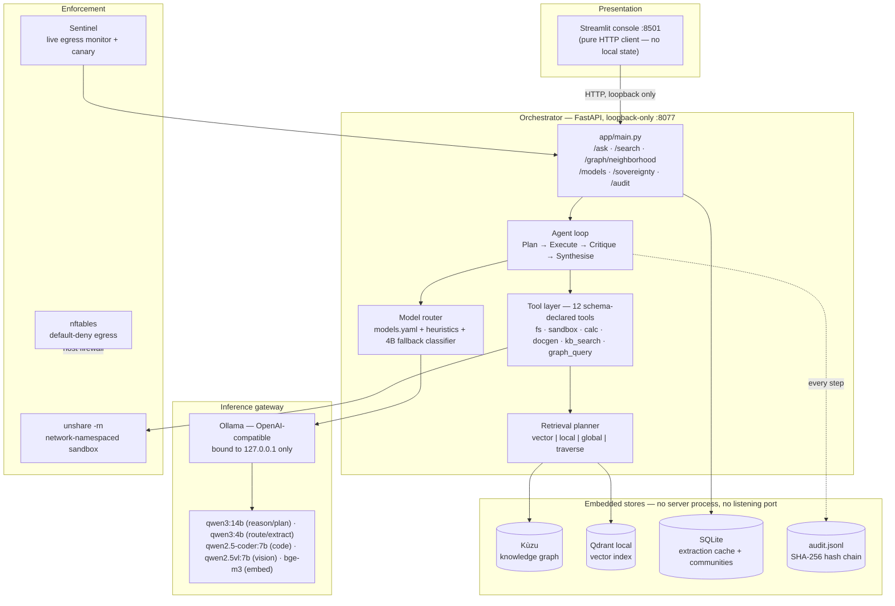
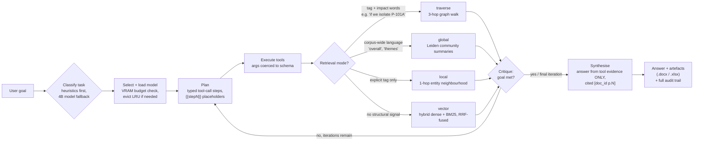
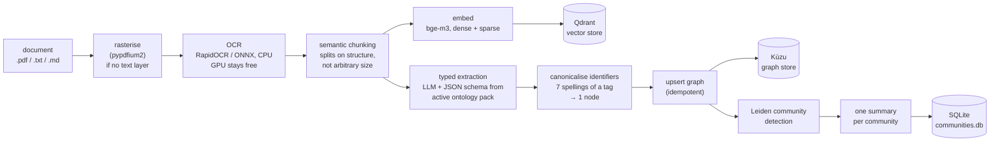
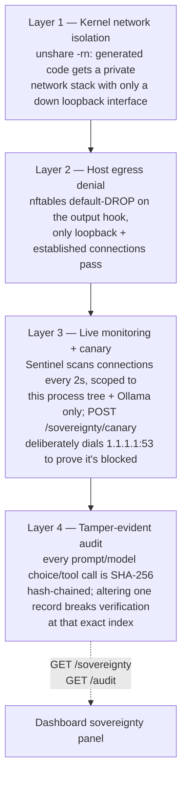

# Sovereign On-Premise Agentic AI Workbench
**SIH 2026 · Problem Statement SIH26117 · Mangalore Refinery and Petrochemicals Limited (MRPL)**

A self-hosted, air-gapped agentic AI workbench for confidential industrial work.
Runs entirely on one consumer GPU. Nothing leaves the machine, and the system
*proves* it rather than claiming it.

---

## Why this design

| PS requirement | How it is met | Where |
|---|---|---|
| 0. Domain portability | Ontology packs in `config/ontology.yaml`; schema is config | `app/graphrag/schema.py` |
| 1. Model auto-selection across task types | Declarative manifest + 2-stage router + VRAM-aware LRU manager; every decision logged | `config/models.yaml`, `app/router/` |
| 2. Agentic task end-to-end | Plan → Execute → Critique → Synthesise loop producing real `.docx`/`.pptx`/`.xlsx` | `app/agent/loop.py`, `app/tools/docgen.py` |
| 3. Coding task run + verified | Sandboxed execution in a network-isolated namespace | `app/tools/sandbox.py` |
| 4. Multimodal understanding | Rasterise → ONNX OCR (CPU) → VLM for handwriting/drawings | `app/ingest/pipeline.py` |
| 5. **Proof** of no external calls | Live egress monitor + canary + hash-chained audit log + nftables lockdown | `app/sentinel/`, `scripts/04_lockdown.sh` |

**Beyond the PS: Graph RAG.** Flat vector search cannot answer *"if we isolate
P-101A, which downstream units are affected?"* — that is a traversal, and
similarity is not connectivity. A P&ID is *literally* a graph, so this system
recovers its native structure instead of flattening it into embeddings.

---

## How it works

Only one process — the API (`app/main.py`) — ever opens the embedded graph
store or vector index; the Streamlit console is a pure HTTP client of it.
This matters: Kùzu (the graph DB) allows many read-only handles on a path,
*or* exactly one read-write handle, never a mix — so a second process opening
the same file directly will deadlock it.

### System architecture



### Online query pipeline (per request)



The synthesis step is explicitly instructed to refuse — *"not found in the
knowledge base, no internet access to fetch it"* — rather than answer from
model memory or present unrelated retrieved material as if it were relevant.
This machine has no internet access at all, ever; the planner is told so
directly, so it never wastes a step attempting a web search that can only
fail.

### Offline indexing pipeline (`make index`)



Every chunk retains `{doc_id, page, bbox}`, so every downstream answer traces
back to an exact page. Extraction is cached by `sha256(prompt + model)` — an
unchanged corpus re-indexes in seconds; a new document costs only its own
chunks.

### Sovereignty — four independent layers



No single layer failing silently removes the guarantee — each is independently
verifiable, and the canary makes the claim falsifiable in front of a judge in
under thirty seconds instead of merely asserted.

---

## Ontology packs

The knowledge-graph schema is **configuration, not code** — `config/ontology.yaml`.
Select packs with `ONTOLOGY=` in `.env`:

| Pack | Node types | Use for |
|---|---|---|
| `general` | Person, Organization, Document, Concept, Technology, Skill, Project, Product, Event, Metric, Dataset, Publication, Location, Section | Any corpus — papers, reports, CVs, correspondence |
| `industrial` | Equipment, Instrument, Line, Procedure, Step, Spec, Incident, Material, Vendor | Refinery / plant documents, P&IDs, SOPs |

```bash
ONTOLOGY=general               # domain-neutral
ONTOLOGY=general,industrial    # both (default)
```

Packs merge: a relation name defined in several packs keeps every endpoint pair
(`PART_OF` covers `Section->Document`, `Project->Organization` *and*
`Equipment->Equipment`). Endpoint pairs referencing a type from a disabled pack
are dropped rather than failing startup. Only types listed under a pack's
`tagged:` key go through asset-tag canonicalisation — a general corpus is never
forced through ISA-5.1 tag parsing.

**Adding a domain is a YAML block.** Changing the ontology changes the database
schema, so wipe and re-index:

```bash
rm -rf data/stores/graph && make index
```

---

## Quick start on a fresh machine

**Prerequisites:** Linux, Python 3.11, an NVIDIA GPU with ≥16 GB VRAM (a
14B-class model needs ~11 GB resident — CPU-only will run but is very slow),
and a current NVIDIA driver. No Docker, no root required for the app itself
(root is only needed for the optional `make lockdown` host firewall).

```bash
# 1. Clone
git clone https://github.com/PrinceVerma04/Industrial-Agentic-AI.git
cd Industrial-Agentic-AI

# 2. Install Ollama (the local model server) if you don't already have it
curl -fsSL https://ollama.com/install.sh | sh

# 3. Create an isolated Python environment — nothing installs system-wide
python3.11 -m venv .venv

# 4. Install PyTorch matching your GPU
#    Blackwell (RTX 50-series, sm_120) needs the CUDA 12.8 build:
./.venv/bin/pip install torch --index-url https://download.pytorch.org/whl/cu128
#    Older NVIDIA GPUs (RTX 30/40-series etc.) can use the stable CUDA 12.4 build instead:
#    ./.venv/bin/pip install torch --index-url https://download.pytorch.org/whl/cu124

# 5. Install the rest of the Python dependencies
./.venv/bin/pip install -r requirements.txt

# 6. Preflight check — confirms GPU, sandbox, and binaries are all in order
make check

# 7. Pull the model set (~24 GB, one-time download — this is the only step
#    that needs internet access; everything after this runs fully offline)
make pull
```

`data/corpus/`, `data/stores/`, `data/artifacts/`, and `data/workspace/` are
gitignored — a fresh clone starts with an empty corpus. Add your own
`.pdf`/`.txt`/`.md` documents to `data/corpus/` before indexing (images are
read on demand by the vision tool but not auto-indexed).

```bash
# 8. Build the index from whatever you put in data/corpus/
make index

# 9. Run the tests to confirm everything installed correctly
make test          # 70 tests, should complete in under a second

# 10. Launch — port-checked, correctly sequenced (API first, then console)
make start
```

Then open **http://127.0.0.1:8501** for the console, or call the API directly
at **http://127.0.0.1:8077**. See [Running it](#running-it) below for what
each `make` target does, and [API](#api) for the raw endpoints.

## Running it

```bash
make index     # ingest data/corpus -> vectors + graph + communities
make start     # port-checked, correctly-sequenced launch of API + console
```

`make start` (`scripts/06_start_all.sh`) refuses to run if port 8077 or 8501
is already occupied, confirms Ollama is up, starts the API, polls `/health`
until it responds, and only then starts the console — the API must always be
the first and only process to open the graph store.

| Command | Purpose |
|---|---|
| `make check` | Preflight: GPU, models, sandbox, binaries |
| `make index` | (Re)build vector index + knowledge graph from `data/corpus/` |
| `make start` | Port-checked launch of API + console together |
| `make serve` | API alone, on `127.0.0.1:8077` |
| `make app` | Console alone, on `127.0.0.1:8501` (needs the API already running) |
| `make demo` | Scripted run covering all five rubric points |
| `make test` | 70-test automated suite, runs in under a second |
| `make watch` | Live indexing progress dashboard |
| `make lockdown` | Install nftables egress denial (requires root) |

**Reindexing note:** Kùzu permits one writer — stop the API (`Ctrl-C`, or
`pkill -f "uvicorn app.main:app"`) before `make index`. The console does not
need to be stopped; it will simply show "cannot reach the API" until you
restart both with `make start`.

## Profiles

`config/models.yaml` defines three. Switch with `PROFILE=` in `.env`.

| Profile | For | Models |
|---|---|---|
| `current` | works today with what is already pulled | `qwen2.5:32b` |
| `venue` | RTX 5080, 16 GB — the demo profile | qwen3:14b · qwen3:4b · coder:7b · qwen2.5vl:7b · bge-m3 |
| `datacenter` | if 120B-class hardware exists | gpt-oss:20b + the above |

Adding a model is a YAML block. No code changes — that is the PS's
"addable later without redesigning the system", made literal.

## VRAM budget (16 GB card)

```
GPU: exactly ONE of { reasoning | vision | coder }   + optionally the 4B utility
CPU: OCR, BM25, reranking, community detection       (32 cores — use them)
```
The `ModelManager` evicts LRU before loading anything that would overflow the
budget, and records what it evicted — visible live in the Models tab and in
every `/ask` response's routing decisions.

## API

| Endpoint | Purpose |
|---|---|
| `POST /ask` | Run an agentic goal end-to-end (`goal`, `max_iterations`, `max_steps`) |
| `GET /search?q=` | Retrieval only — which mode fired, why, matched passages |
| `GET /graph/neighborhood?entity=&hops=` | Direct N-hop graph traversal from an entity |
| `GET /models` | Catalogue, residency, routing decision log |
| `GET /health` | Graph/vector totals, tool count, profile |
| `GET /sovereignty` | Egress counters, sandbox caps, audit-chain validity |
| `POST /sovereignty/canary` | Deliberate external call — must be BLOCKED |
| `GET /audit` | Hash-chained audit tail |

## Demo (6 minutes)

1. Upload a scanned inspection report → OCR + VLM extract findings *(point 4)*
2. "Draft an approval note recommending seal replacement" → agent traverses
   the graph for downstream impact → real `.docx` *(point 2)*
3. Router log shows more than one model firing across the run *(point 1)*
4. "Which units are affected if P-101A is isolated?" → graph traversal finds
   a two-hop dependency that shares no vocabulary with the query — show
   vector-only search failing the same question side by side
5. "Write and verify a script computing pump NPSH" → sandbox, steps shown *(point 3)*
6. `sudo ./scripts/04_lockdown.sh on`, then hit the canary → **BLOCKED**,
   `external_connections: 0` *(point 5)*

## Grounding — verifying the system isn't hallucinating

The agent is instructed to refuse rather than fabricate when nothing relevant
is retrieved, and to never attempt or assume internet access. To check this
yourself on your own data: run the same query in **Search** first (retrieval
only, cannot fabricate) — if it returns nothing relevant, **Ask** must refuse
too. Cross-check every `[doc_id p.N]` citation against `data/corpus/`. This is
a prompt-level mitigation, not yet a mechanical gate — treat every answer as
needing this check, not as unconditionally trustworthy.

## Air-gap bundle

```bash
tar czf models.tar.gz -C ~/.ollama models
./.venv/bin/pip download -r requirements.txt -d ./wheels
```
Then `HF_HUB_OFFLINE=1 TRANSFORMERS_OFFLINE=1` and rehearse with Wi-Fi off.
Do this in week 1, not week 8.
